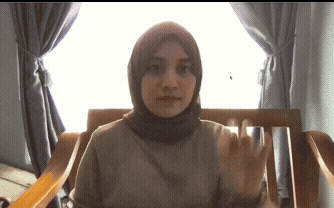

# Sign Language Detection Model - Indonesian Language (SIBI - Sistem Isyarat Bahasa Indonesia)

## A Computer Vision project to Detect Hand Sign for Sign Language - Still on progress.

   
  <em>Signing My Name: Millatina </em>

### Key Takeaways:

- Personally, learning a new language!
- Contributing to accessability of communication between deaf & non-deaf people.
- The training performance is excellent, but the live test using webcam shows accuracy and confidence level badly, especially the further away the hand from the camera.
- Next action: to train with bigger model, adding more classes like numericals (1-10) and commmon expressions.

### Objectives:
This computer vision project is to detect sign language from hand gestures. Utilizing AI/ML to contribute to more accessible ways of communication between deaf and non-deaf people in Indonesia.

#### Prelimenary
This is a preliminary to first test out workflows, integration, dataset, dependencies and model. 

As the preliminary model, it's trained on yolov5n which has small capacity, with fewer epochs (10) for faster training, and smaller image size (320 x 320 pixels) for faster inference which can result in lower accuracy. As of now, the training is for only alphabetic SIBI signs which is 26 class. 

Continuously, the classes will be added, like numericals, common expressions, etc. 

### IDEs:
- Google Colab for training and validation
- Running the live test using VS Code

### The dataset:
The dataset is retrieved from Roboflow [here](https://universe.roboflow.com/my-projects-7vrlf/sign-language-sibi-katux)

### Model: 

This model is utilizing YOLO version 5 Nano through ultralytics.

### Results:

The performance metrics for training are excellent like shown in the plot below:

   
  <em>YOLOv5n Training Metrics</em>

It shows that overtime, the precision, recall, Mean Average Precision and the Average of Mean Average Precision are increasing during the training. The metrics are improving the more training cycles have been completed. 

### Live Test on Webcam

Testing the model live using webcam on MacOS (localhost). Even though the training's performance is excellent, during the live testing, the accuracy and the confidence in detecting hands and signs become worse. The more distance the hands from the camera, the less accurate the detections are, especially in signing similar gestures like the letter A, M, N. The gif file above has better accuracy and confidence level since the hand is closer to the camera.

### Next Action
- To train with bigger model and more epochs.
- Try other algorithms
- To train more classes: like numericals (1-10) and common expressions.
